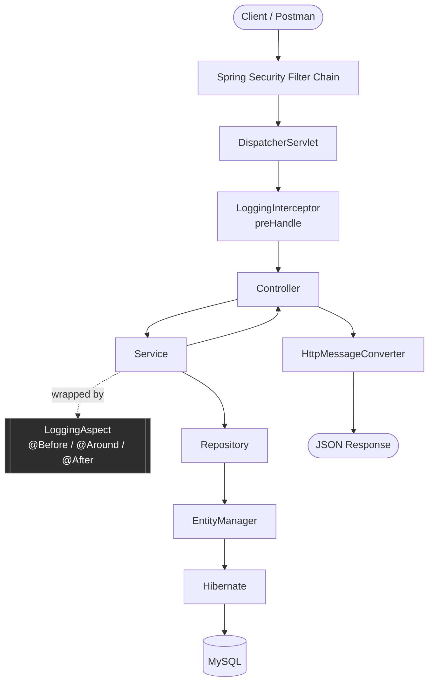
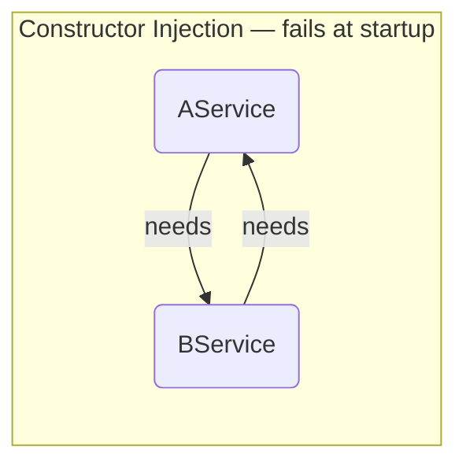
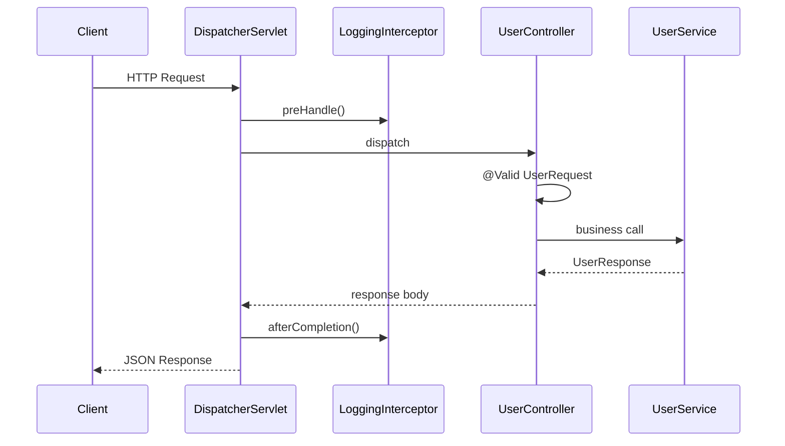
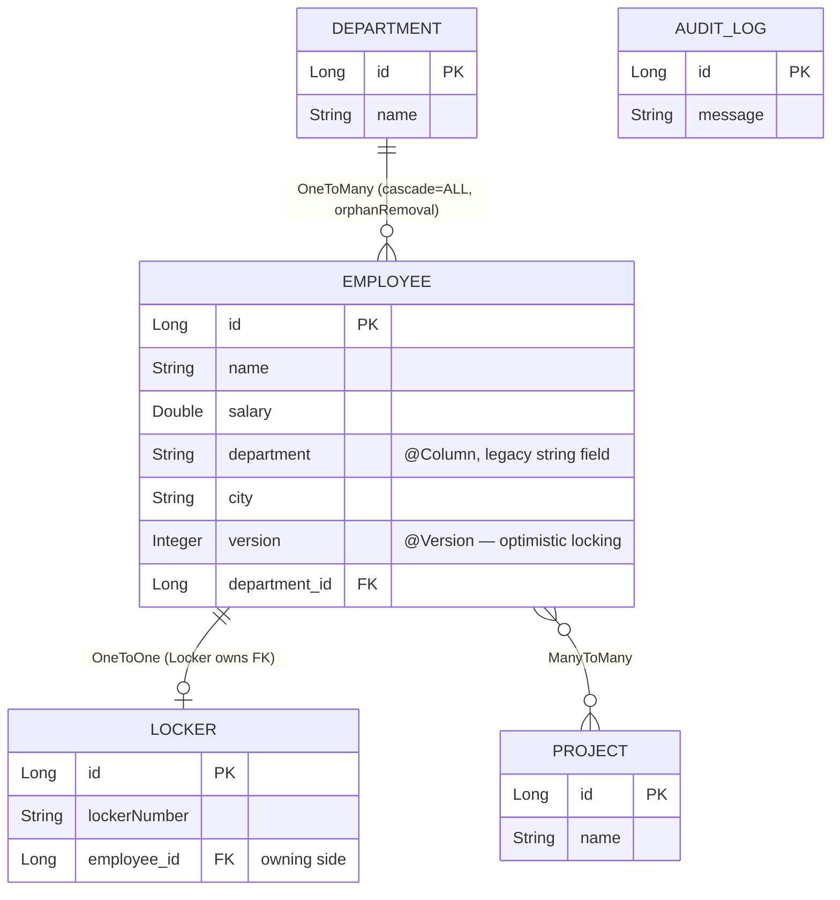
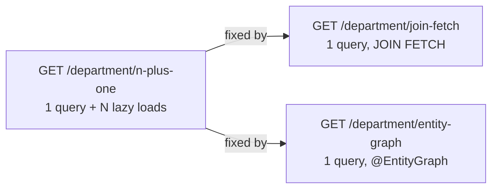
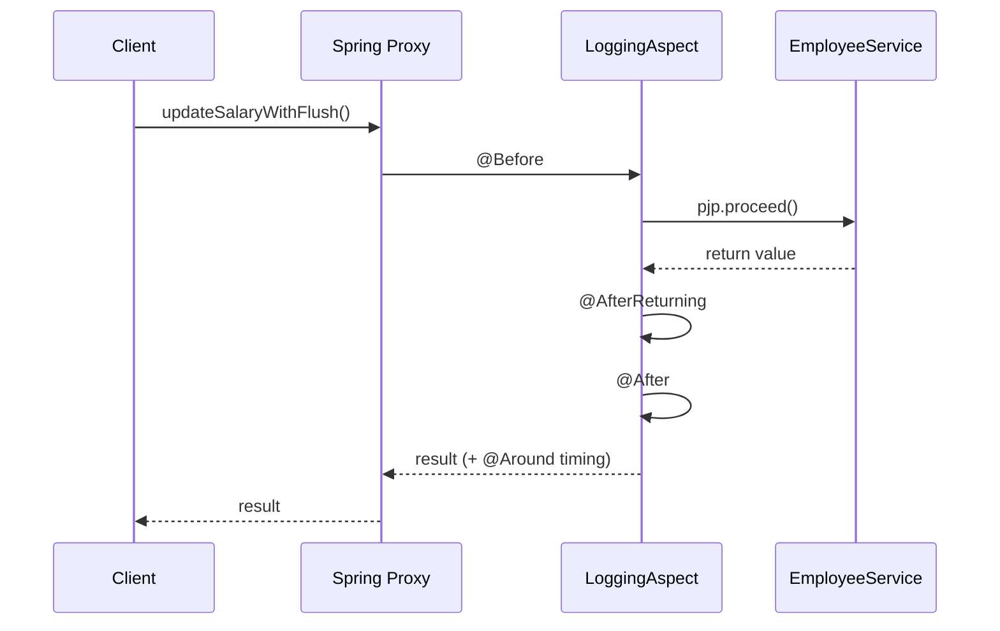
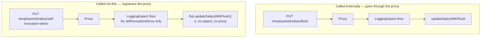
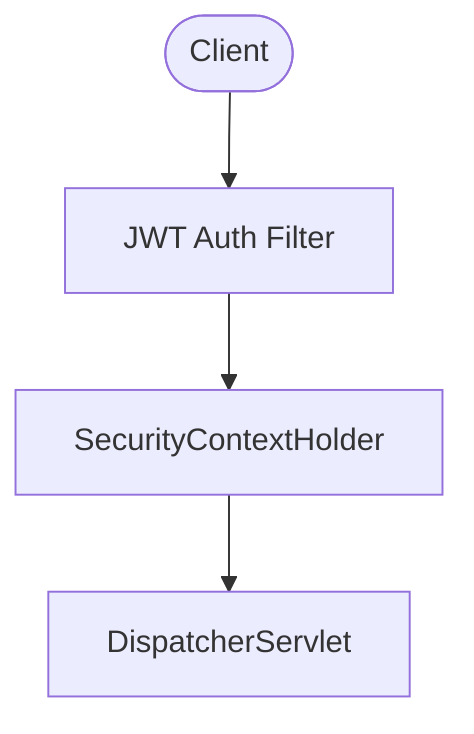
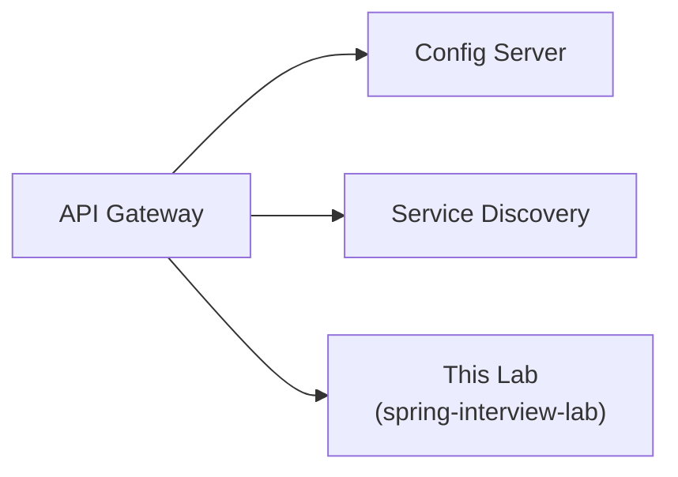

# 🧪 Spring Interview Lab

A runnable Spring Boot playground built to *see* interview concepts happen, not just read about them — every topic below is backed by real code in this repo and a real endpoint you can hit.

```
IoC & DI  →  Spring MVC  →  Spring Data JPA  →  Spring AOP  →  Spring Security  →  Spring Cloud
  (Core)      (REST)          (Persistence)     (Cross-cutting)  (Auth)          (Distributed)
```

---

## 📚 Docs Index

| # | Guide | Covers |
|---|---|---|
| 1 | [Spring Core](docs/01-Spring-Core-README.md) | IoC, DI, Bean lifecycle, `BeanFactory` vs `ApplicationContext`, circular dependencies, `@Primary`/`@Qualifier` |
| 2 | [Spring MVC](docs/02-Spring-MVC-README.md) | `DispatcherServlet`, `HandlerMapping`/`HandlerAdapter`, `@RequestBody`, Filter vs Interceptor, JWT flow |
| 3 | [Spring Data JPA](docs/03-Spring-JPA-README.md) | Entities, Persistence Context, queries (derived/JPQL/native/Specification/QueryDSL), relationships, N+1, transactions |
| 4 | [Spring AOP](docs/04-Spring-AOP-README.md) | Proxies, Aspect/Advice/Pointcut, `@Around`, self-invocation |
| 5 | Spring Security | Auth filter chain, JWT, method security |
| 6 | Spring Cloud | Config Server, service discovery, API Gateway |

Each guide pairs every concept with the file and endpoint that demonstrates it — this README is the map; the docs are the territory.

---

## 🏗️ How a Request Actually Flows Through This Lab



Every arrow above is a real, separately-documented concept: the interceptor is [Spring MVC §10](docs/02-Spring-MVC-README.md), the aspect wrapping the service is [Spring AOP §3](docs/04-Spring-AOP-README.md), and everything from Repository down is [Spring Data JPA §6-9](docs/03-Spring-JPA-README.md).

---

## 1️⃣ Spring Core — IoC & Dependency Injection

**Package:** `com.interview.labs.core.*`

Demonstrates the same circular-dependency problem solved four different ways. `constructor`, `field`, and `lazy` ship as commented-out code — a live constructor-injection circular dependency crashes app startup, so you uncomment one demo at a time to reproduce it. `setter` is the one left active.



| Package | Resolution | Runnable as-is? |
|---|---|---|
| `core.constructor` | None — demonstrates the failure | ❌ commented out |
| `core.field` | Field injection tolerates it (proxy exposed early) | ❌ commented out |
| `core.lazy` | `@Lazy` on one side breaks the cycle | ❌ commented out |
| `core.setter` | Setter injection resolves it | ✅ active |
| `core.bestpractice` | Refactor away the cycle entirely | ✅ active (`NotificationService`) |

Full explanation: [docs/01-Spring-Core-README.md](docs/01-Spring-Core-README.md)

---

## 2️⃣ Spring MVC — REST Layer

**Package:** `com.interview.labs.mvc.*`



| Endpoint | Demonstrates |
|---|---|
| `POST /users` | `@RequestBody` + bean validation (`@Valid`) |
| `GET /users/{id}` | `@PathVariable`, `GlobalExceptionHandler` → 404 on miss |
| `GET /users?name=` | `@RequestParam` filtering |

`WebMvcConfig` registers `LoggingInterceptor` (`preHandle`/`afterCompletion`) globally. `GlobalExceptionHandler` (`@RestControllerAdvice`) maps `UserNotFoundException` → HTTP 404 in one place instead of a try/catch per controller.

Full explanation: [docs/02-Spring-MVC-README.md](docs/02-Spring-MVC-README.md)

---

## 3️⃣ Spring Data JPA — Persistence

**Package:** `com.interview.labs.jpa.*`



`AuditLog` has no foreign keys — it's written by `AuditLogService` on its own `REQUIRES_NEW` transaction, independent of whatever else is happening (see transaction demo below).

### Query techniques, one endpoint each

| Technique | Endpoint |
|---|---|
| Derived Query | `GET /employee/derived/department?departmentName=` |
| JPQL | `GET /employee/salary/jpql/{salary}` |
| Native Query | `GET /employee/salary/{salary}` |
| Pagination (`Page`) | `GET /employee/page?page=&size=` |
| Slice (no COUNT) | `GET /employee/slice?page=&size=` |
| Sorting | `GET /employee/sort` |
| Interface / DTO Projection | `GET /employee/projection`, `/employee/projectionDto` |
| Specification (Criteria API) | `GET /employee/specification?salary=` |
| QueryDSL | `GET /employee/querydsl?salary=&name=` |
| Dynamic SQL (validated column) | `GET /employee/search?column=&value=` |

### Relationships & the N+1 problem, live



| Endpoint | Demonstrates |
|---|---|
| `PUT /department/{deptId}/employee/{empId}` | Cascade — assigning saves both sides |
| `DELETE /department/{deptId}/employee/{empId}` | `orphanRemoval` — deletes the Employee row, not just the link |
| `PUT /employee/{id}/salary/optimistic?salary=&version=` | `@Version` — pass a stale version to trigger `OptimisticLockException` |
| `PUT /employee/{id}/salary/flush?salary=` | Explicit `entityManager.flush()` |
| `POST /employee/{id}/salary/audit?salary=&simulateFailure=` | `REQUIRES_NEW` + `rollbackFor` — the audit row survives even when the salary update rolls back |

Full explanation: [docs/03-Spring-JPA-README.md](docs/03-Spring-JPA-README.md)

---

## 4️⃣ Spring AOP — Cross-Cutting Concerns

**Package:** `com.interview.labs.aop.*` — `LoggingAspect` advises every method under `com.interview.labs.jpa.service.*`.



All 5 advice types run on every `/employee/...` call — check the console.

### The self-invocation trap, made visible



Same mechanism `@Transactional` relies on — which is exactly why a `@Transactional` method silently stops being transactional when called via `this.` from inside the same bean.

Full explanation: [docs/04-Spring-AOP-README.md](docs/04-Spring-AOP-README.md)

---

## 5️⃣ Spring Security — Auth Layer

**Package:** `com.interview.labs.security.*`



| Concept | Covers |
|---|---|
| `JwtAuthenticationFilter` | Reads the `Authorization` header, validates the token before the request reaches `DispatcherServlet` |
| `UserDetailsService` | Loads user + authorities for the authentication manager |
| `SecurityContextHolder` | Where the authenticated principal lives for the rest of the request |
| `@PreAuthorize` | Method-level authorization on controllers/services |

Full explanation: docs/05-Spring-Security-README.md

---

## 6️⃣ Spring Cloud — Distributed Concerns

**Package:** `com.interview.labs.cloud.*`



| Concept | Covers |
|---|---|
| Config Server | Externalized `application.properties`, refreshed without a redeploy |
| Service Discovery | Eureka — other services find this one by name, not a hardcoded host |
| API Gateway | Single entry point in front of this app, routing and cross-cutting concerns (rate limiting, auth) |

Full explanation: docs/06-Spring-Cloud-README.md

---

## ⚙️ Tech Stack

| | |
|---|---|
| Language | Java 17 |
| Framework | Spring Boot 3.2.5 |
| Persistence | Spring Data JPA + Hibernate |
| Database | MySQL |
| Dynamic queries | QueryDSL 5.1.0 (`querydsl-jpa`, Jakarta classifier) |
| Boilerplate | Lombok |
| Build | Maven |

---

## 🚀 Getting Started

1. **Create the database** (schema auto-creates/updates via `ddl-auto=update`):
   ```sql
   CREATE DATABASE testdb;
   ```
2. **Set your credentials** in `src/main/resources/application.properties` (defaults to `root` / `password` on `localhost:3306`).
3. **Run it:**
   ```bash
   mvn spring-boot:run
   ```

> This project targets **Java 17** (`pom.xml` → `<java.version>`). If your default `java -version` reports something newer (e.g. 21+/25), Lombok's annotation processor may fail to compile — point `JAVA_HOME` at a JDK 17 install for `mvn` commands if that happens.

---

## 🗂️ Project Structure

```text
src/main/java/com/interview/labs
├── Application.java
├── core/                  # IoC & DI — circular dependency demos
│   ├── bestpractice/
│   ├── constructor/
│   ├── field/
│   ├── lazy/
│   └── setter/
├── mvc/                   # REST layer
│   ├── config/            # WebMvcConfig, LoggingInterceptor
│   ├── controller/
│   ├── dto/
│   ├── exception/
│   └── service/
├── jpa/                   # Persistence
│   ├── entity/            # Employee, Locker, Department, Project, AuditLog
│   ├── repository/        # + projection/, Specification, QueryDSL
│   ├── service/
│   ├── controller/
│   ├── dto/
│   └── specification/
└── aop/
    └── LoggingAspect.java
```

---

⭐ If this lab helped you prep, consider starring the repository.
